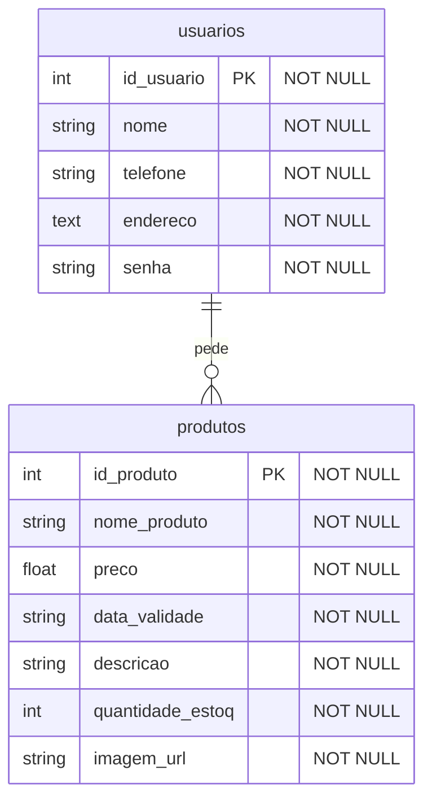

```mermaid
erDiagram
    produtos {
        int id_produto PK "NOT NULL"
        string nome_produto "NOT NULL"
        float preco "NOT NULL"
        string data_validade "NOT NULL"
        string descricao "NOT NULL"
        int quantidade_estoq "NOT NULL"
        string imagem_url "NOT NULL"
    }

    usuarios {
        int id_usuario PK "NOT NULL"
        string nome "NOT NULL"
        string telefone "NOT NULL"
        text endereco "NOT NULL"
        string senha "NOT NULL"
    }

    usuarios ||--o{ produtos : "pede"
   
```
